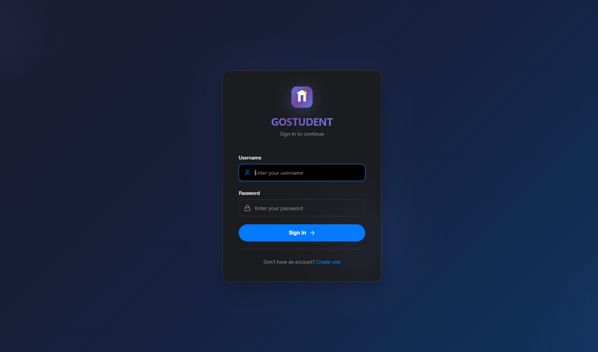
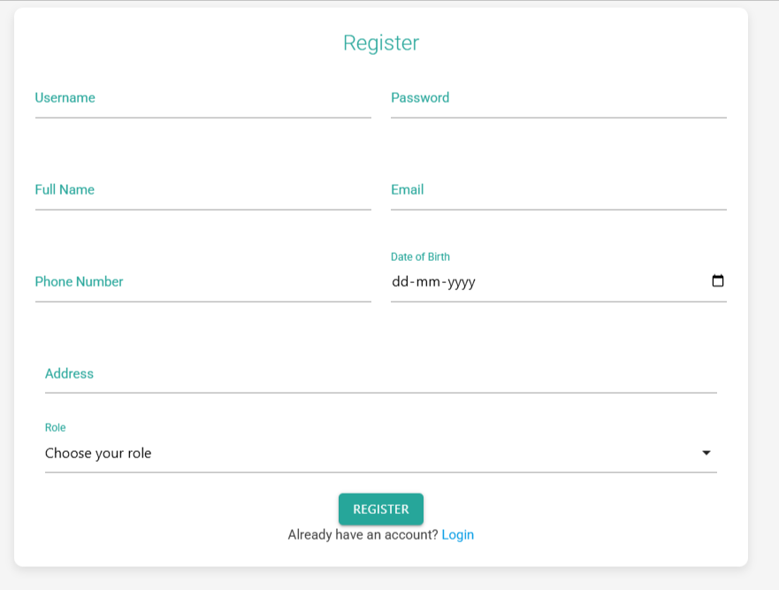
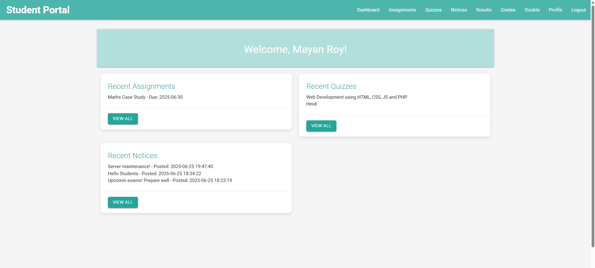
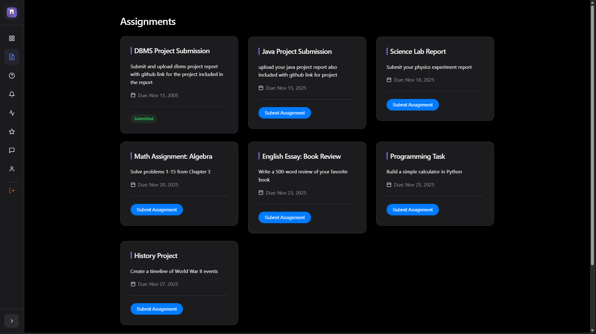
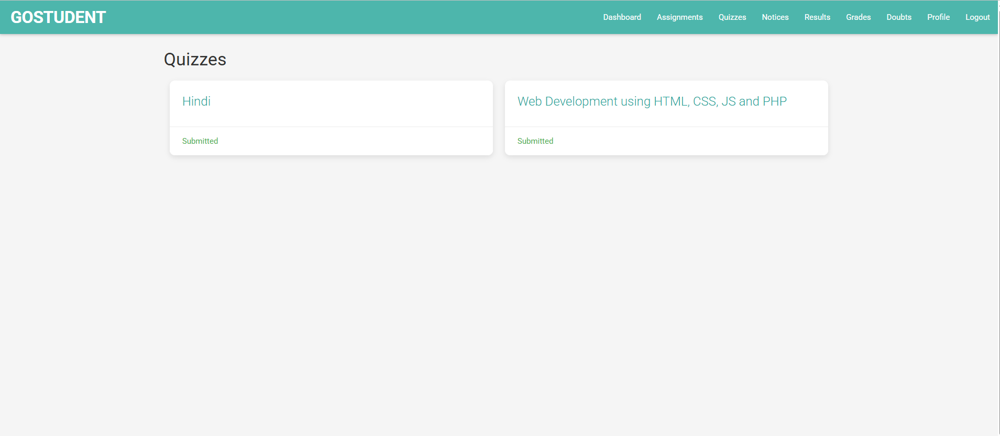
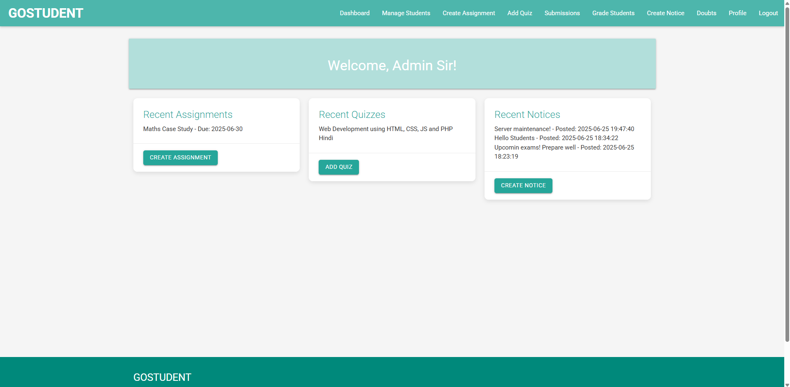
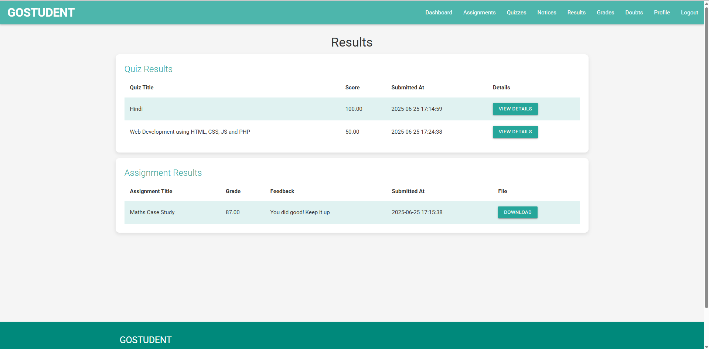
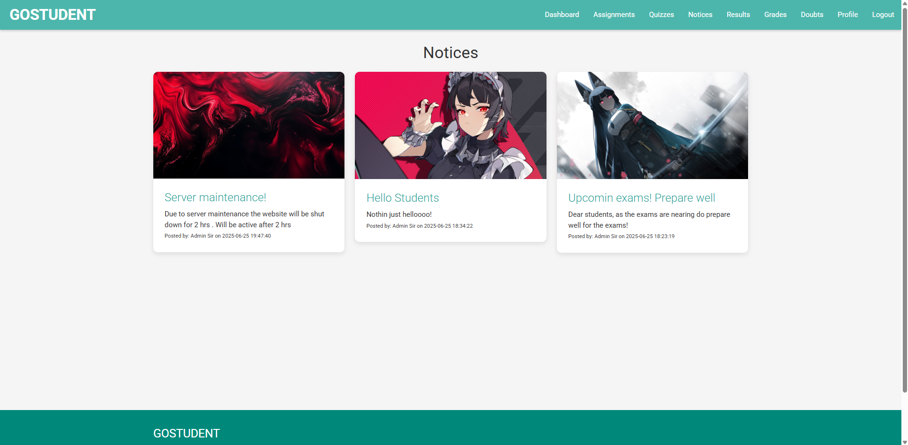

# **🎓 GOSTUDENT - Student Portal**

A modern, responsive web-based academic platform that allows students and teachers to manage assignments, quizzes, notices, grades, and a doubt-resolution system. Features a beautiful Apple-inspired design system with shadcn principles, built using PHP and MySQL.

---


## 🔑 **Features**

### 👥 User Authentication

* Secure login and registration
* Role-based dashboards for students and teachers

### 🧑‍🎓 Student Panel

* View and submit assignments with file uploads
* View quiz results and details
* Read notices posted by teachers
* Post, reply to, and resolve academic doubts
* View grades and teacher feedback
* Update personal profile (name, email, phone, address, DOB)

### 👩‍🏫 Teacher Panel

* Create and manage assignments and quizzes
* Post notices with images
* Grade student submissions and add feedback
* Participate in doubt discussions with students
* Edit teacher profile details

---

## 🎨 **UI & Design**

* **Apple-inspired design system for design** with shadcn principles
* **System font stack** (SF Pro Display, -apple-system) for optimal performance
* **Inline SVG icons** for crisp, scalable graphics
* **Glassmorphic navigation design** with backdrop blur
* **Smooth animations** and micro-interactions
* **Dark mode theme** via `prefers-color-scheme`
* **Fully responsive for different devices** layout (mobile, tablet, desktop)
* **Accessibility-first** approach (WCAG AA compliant)
* **Custom CSS** - no external framework dependencies

---

## 🛠️ **Technologies Used**

### Frontend

* HTML5, CSS3, JavaScript
* **Custom Apple-inspired CSS** (`assets/css/apple-theme.css`)
* **System fonts** (no external font loading)
* **Inline SVG icons** (no icon library needed)
* **Minimal JavaScript** (modals and mobile menu only)


### Backend

* PHP 7.4+
* MySQL with PDO (secure DB access)

---

## ⚙️ **Installation (Using XAMPP)**

### 🔧 Prerequisites

* XAMPP installed (Apache + MySQL)
* PHP 7.4+ (included in XAMPP)
* Web browser (Chrome, Edge, etc.)

---

### 📥 1. Clone or Copy the Project

* Download or clone the repository:

```bash
git clone https://github.com/MR-1124/GOSTUDENT-Student-Portal-PHP.git
```

* Move the entire folder to:

```
C:\xampp\htdocs\GOSTUDENT-Student-Portal-PHP
```

---

### 🚀 2. Start XAMPP

* Open **XAMPP Control Panel**
* Click **Start** next to **Apache** and **MySQL**

---

### 🧬 3. Import the Database

1. Go to [http://localhost/phpmyadmin](http://localhost/phpmyadmin)
2. Click **New** and create a database named:
   `student_portal`
3. Go to the **Import** tab
4. Choose `database/db.sql` from the project folder
5. Click **Go** to import tables and data
6. (Optional) Import `database/quick_sample_data.sql` for sample content

---

### ⚙️ 4. Configure Database Connection

Edit `includes/db.php`:

```php
$host = 'localhost';
$dbname = 'student_portal';
$username = 'root';
$password = 'your_password_here_for_mysql';
```

---

### 🔒 5. File Upload Permissions

Ensure `assets/uploads/` is writable.

---

### 🌐 6. Run the Project

Visit in your browser:

```
http://localhost/GOSTUDENT-Student-Portal-PHP/
```

You can register a new student/teacher or log in using any default credentials if included in `db.sql`.

---

### Few Screenshots

















---

## ✨ **What's New in Version 2.1**

### 🎨 Major UI Improvements
* **Collapsible Side Navbar** - Modern sidebar with smooth expand/collapse
* **Redesigned Login/Signup** - Glassmorphic cards with animated backgrounds
* **Enhanced Notice Cards** - Professional layout with fixed image sizing
* **Improved Components** - Better cards, tables, and forms
* **New Dashboard Elements** - Welcome banners, stats grids, page headers

### 🐛 Critical Bug Fixes
* **File Upload Fixed** - Assignments now support PDF, DOC, DOCX, and more
* **Header Warning Fixed** - Resolved "headers already sent" errors
* **Notice Images Fixed** - Images now display correctly with proper sizing

### 🚀 Performance & Features
* **Multi-Type File Support** - Documents (10MB) and images (5MB)
* **State Persistence** - Sidebar remembers collapsed/expanded state
* **Better Error Messages** - Clear feedback for file uploads
* **Sample Data Included** - Quick setup with pre-made content

### 📱 Enhanced Mobile Experience
* **Responsive Sidebar** - Slides off-screen on mobile
* **Touch-Friendly** - Better button sizes and interactions
* **Adaptive Layouts** - Cards and forms stack properly
* **Smooth Animations** - 60fps transitions throughout

---

## 🔐 **Security Features**

* 🛡️ **XSS Protection**: `htmlspecialchars()` used across outputs
* 🛡️ **SQL Injection Prevention**: All queries use **PDO prepared statements**
* 🛡️ **Role-Based Access**: Custom `checkStudent()` and `checkTeacher()` functions
* 🛡️ **Secure Uploads**: File type validation and safe storage

---

## 📚 **Documentation**

* **[CHANGELOG.md](CHANGELOG.md)** - Complete version history and changes
* **[database/README.md](database/README.md)** - Database files guide
* **Sample Data** - Use `database/quick_sample_data.sql` for quick setup
* **Database Schema** - See `database/db.sql` for complete structure

### Design Inspiration

* **Apple Human Interface Guidelines** - Design principles and patterns
* **shadcn/ui** - Component architecture and utility-first approach
* **System Fonts** - Using native OS fonts for optimal performance

---

## 🙌 **Acknowledgments & References**

This project was developed as part of a summer web development training program. AI tools were used for assistance during the coding process, but all logic, structure, and design decisions were made by me.

### 🤝 Help/References:

* **AI Tools:** Used to assist with logic design, PHP debugging, code generation, and bug fixing
* **Apple Design Resources:** For design inspiration and principles
* **shadcn/ui:** For component architecture patterns
* **React Bits:** For design inspiration and UI patterns
* **W3Schools & PHP Manual:** For syntax references, MySQL PDO examples, and form handling

> ⚠️ **AI Usage Note:**
> Some portions of the code (e.g., post functionality, layout scaffolding, utility functions) were generated with the help of AI tools. AI assistance was also used for debugging issues during sidebar implementation and fixing various design bugs while working on the project. All code was reviewed, understood, modified, and integrated manually by me. This project represents my own learning and effort.

---

## 📄 **License**

This project is licensed under the **MIT License**.

---

## 🤝 **Contributing**

Pull requests are welcome!

1. Fork the repo
2. Create a branch:
   `git checkout -b feature/your-feature`
3. Commit your changes
4. Push and submit a PR

---

