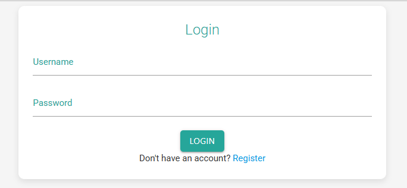

# **🎓 Student Portal**

A modern, responsive web-based academic platform that allows students and teachers to manage assignments, quizzes, notices, grades, and a doubt-resolution system. Designed with a Material You-inspired interface and built using PHP and MySQL.

---

## 🔑 **Features**

### 👥 User Authentication

* Secure login and registration
* Role-based dashboards for students and teachers

### 🧑‍🎓 Student Panel

* View and submit assignments with file uploads
* View quiz results and breakdowns
* Read notices posted by teachers
* Post, reply to, and resolve academic doubts
* View grades and teacher feedback
* Update personal profile (name, email, phone, address, DOB)

### 👩‍🏫 Teacher Panel

* Create and manage assignments and quizzes
* Post notices with optional images
* Grade student submissions and provide feedback
* Participate in doubt discussions
* Edit teacher profile details

---

## 🎨 **UI & Design**

* Material You-inspired visual design
* Poppins font via Google Fonts
* Material Icons for UI elements
* Smooth animations 
* Fully responsive layout (mobile + desktop)

---

## 🛠️ **Technologies Used**

### Frontend

* HTML5, CSS3, JavaScript
* [Materialize CSS v1.0.0](https://cdnjs.cloudflare.com/ajax/libs/materialize/1.0.0/)
* [Google Fonts – Poppins](https://fonts.googleapis.com/css2?family=Poppins)


### Backend

* PHP 7.4+
* MySQL with PDO (secure DB access)

---

## ⚙️ **Installation (Using XAMPP)**

### 🔧 Prerequisites

* XAMPP installed (Apache + MySQL)
* PHP 7.4+ (included in XAMPP)
* Web browser (Chrome, Edge, etc.)

---

### 📥 1. Clone or Copy the Project

* Download or clone the repository:

```bash
git clone https://github.com/MR-1124/GOSTUDENT-Student-Portal-PHP.git
```

* Move the entire folder to:

```
C:\xampp\htdocs\GOSTUDENT-Student-Portal-PHP
```

---

### 🚀 2. Start XAMPP

* Open **XAMPP Control Panel**
* Click **Start** next to **Apache** and **MySQL**

---

### 🧬 3. Import the Database

1. Go to [http://localhost/phpmyadmin](http://localhost/phpmyadmin)
2. Click **New** and create a database named:
   `student_portal`
3. Go to the **Import** tab
4. Choose `db.sql` from the project folder
5. Click **Go** to import tables and data

---

### ⚙️ 4. Configure Database Connection

Edit `includes/db.php`:

```php
$host = 'localhost';
$dbname = 'student_portal';
$username = 'root';
$password = '';
```

---

### 🔒 5. File Upload Permissions

Ensure `assets/uploads/` is writable.
(Windows users generally don’t need to change anything)

---

### 🌐 6. Run the Project

Visit in your browser:

```
http://localhost/GOSTUDENT-Student-Portal-PHP/
```

You can register a new student/teacher or log in using any default credentials if included in `db.sql`.

---

### Few Screenshots




## 🔐 **Security Features**

* 🛡️ **XSS Protection**: `htmlspecialchars()` used across outputs
* 🛡️ **SQL Injection Prevention**: All queries use **PDO prepared statements**
* 🛡️ **Role-Based Access**: Custom `checkStudent()` and `checkTeacher()` functions
* 🛡️ **Secure Uploads**: File type validation and safe storage

---

## 🙌 **Acknowledgments & References**

This project was developed as part of a summer web development training program. AI tools were used for assistance during the coding process, but all logic, structure, and design decisions were made by the developer.

### 🤝 Help/References:

* **ChatGPT (OpenAI):** Used to assist with logic design, PHP debugging, and code generation
* **MaterializeCSS Documentation:** For UI components and responsive layout
* **W3Schools & PHP Manual:** For syntax references, MySQL PDO examples, and form handling

> ⚠️ **AI Usage Note:**
> Some portions of the code (e.g., post functionality, layout scaffolding, utility functions) were generated with the help of AI tools like ChatGPT. All code was reviewed, understood, modified, and integrated manually by me. This project represents my own learning and effort.

---

## 📄 **License**

This project is licensed under the **MIT License**.
See the `LICENSE` file for details.

---

## 🤝 **Contributing**

Pull requests are welcome!

1. Fork the repo
2. Create a branch:
   `git checkout -b feature/your-feature`
3. Commit your changes
4. Push and submit a PR

---

